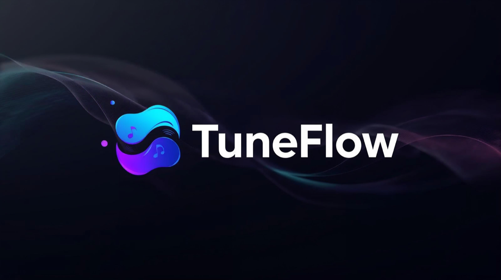

# TuneFlow

TuneFlow is a native Android TV / Fire TV Navidrome client built for remote-first music browsing, large artwork, and smooth queue-based playback on the big screen.

## Why TuneFlow

- TV-first layout with visible focus states and D-pad-friendly navigation
- Album, playlist, artist, favorites, and search flows built around artwork
- Queue resume after restart
- Direct Navidrome streaming with no app-side bitrate or transcoding parameters added

## Install

### Download the latest APK

- Stable link: [tuneflow-tv.apk](https://github.com/Venkatpandey/TuneFlow/releases/latest/download/tuneflow-tv.apk)
- All releases: [GitHub Releases](https://github.com/Venkatpandey/TuneFlow/releases)

### Fire TV / Android TV

1. Download `tuneflow-tv.apk`.
2. Open the APK from Downloader, a browser, or local file transfer.
3. Allow installs from unknown sources if your device asks.
4. Install and launch TuneFlow.

## Login

1. Open TuneFlow.
2. Enter your Navidrome URL.
   Examples:
   - `https://music.example.com`
   - `http://192.168.1.10:4533`
3. Enter your username and password.
4. Press `Login`.

## What You Can Do

- Continue listening from the saved queue
- Browse newest albums
- Open playlists with collage artwork
- Open artists and drill into their albums
- View read-only favorites from Navidrome starred items
- Search with recent queries and live suggestions
- Use play/pause/previous/next on the Now Playing screen
- Logout to switch users on the same TV

## Streaming Quality

TuneFlow requests playback from Navidrome using direct `stream.view` URLs and does not add `maxBitRate` or transcoding `format` parameters.

That means TuneFlow is designed to request the original stream as served by Navidrome. If you play FLAC and your Navidrome server is configured to serve the original file, TuneFlow will request that raw stream.

## Troubleshooting

- Login fails:
  Check the server URL, credentials, and whether the TV can reach your Navidrome server.
- Plain IP login fails:
  Make sure the server is reachable on your local network and the IP/port are correct.
- Empty library or missing items:
  Verify your Navidrome account has access to the content.
- Playback problems:
  Check server reachability and test the same track from another Navidrome client.

## Privacy

- Passwords are not stored directly.
- Session token data stays on-device.
- Search history is stored locally on the TV for convenience.

## Developer Docs

Developer setup, local release signing, and CI/release workflow live in [scripts/README.md](scripts/README.md).
